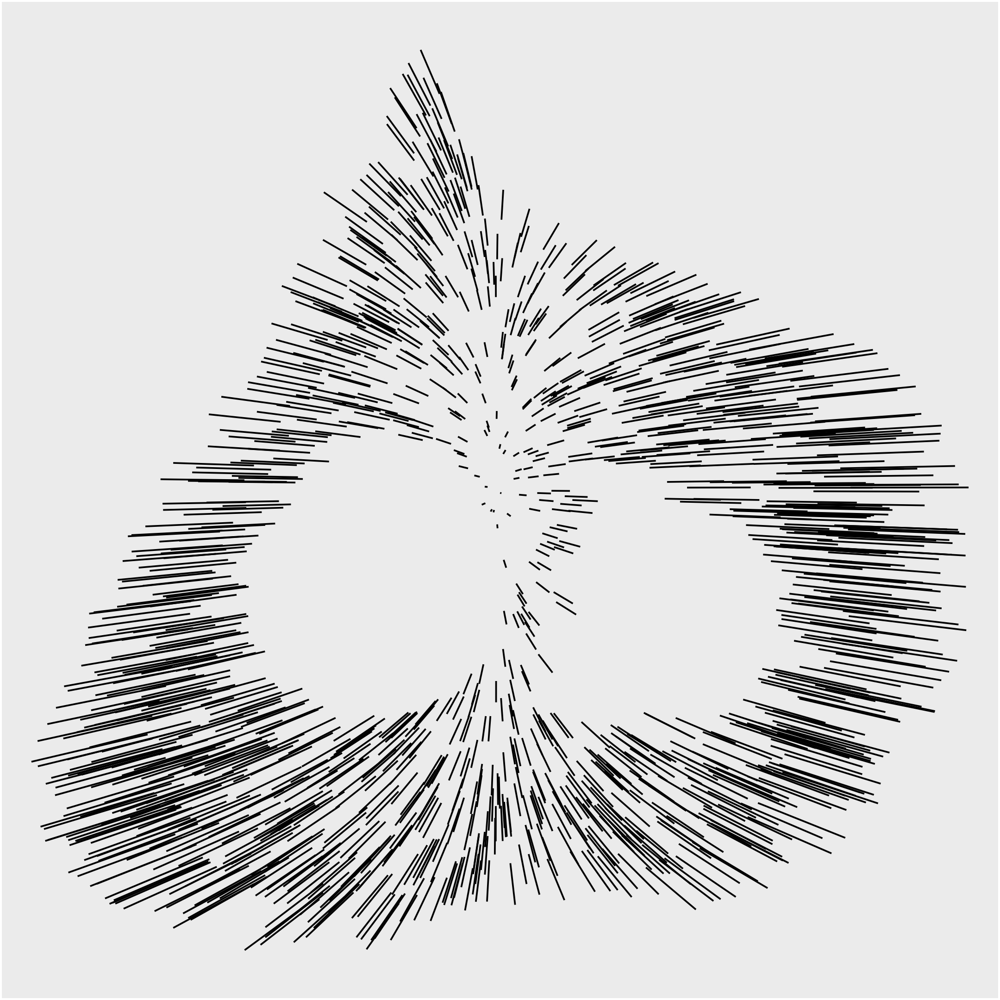
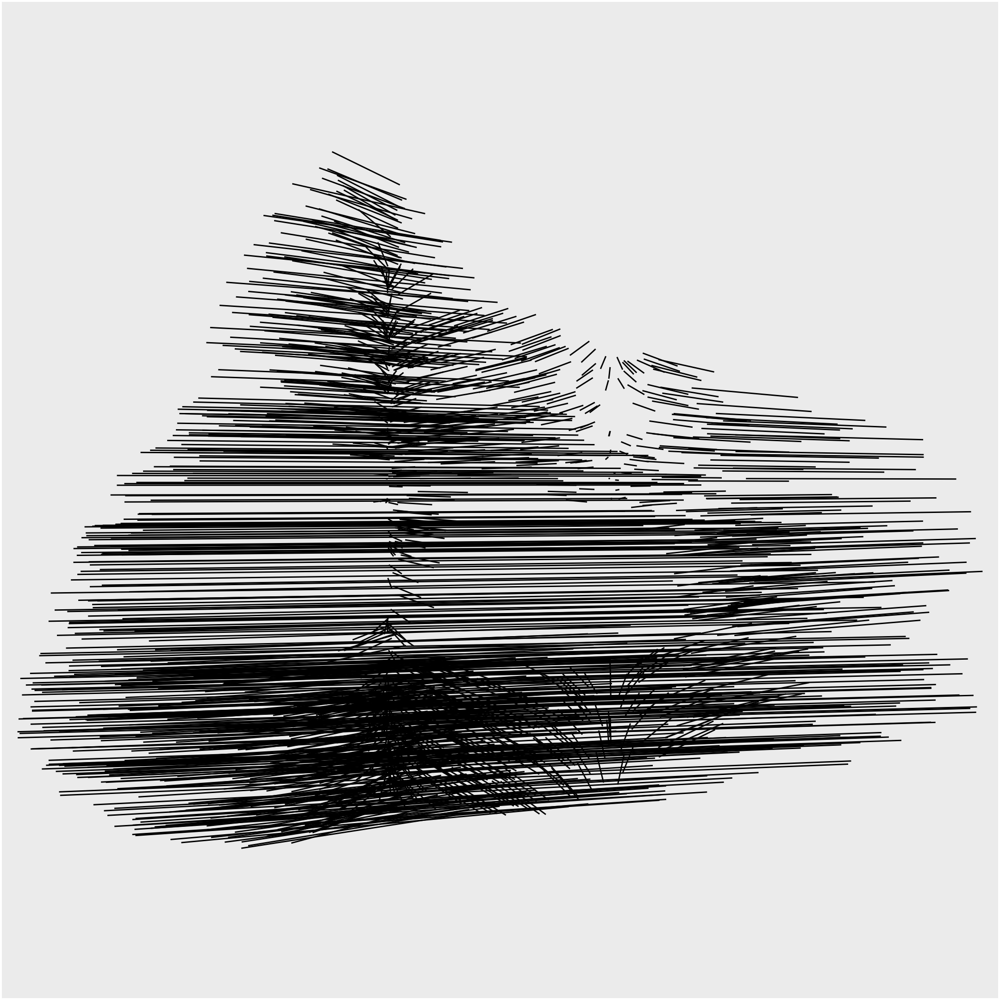
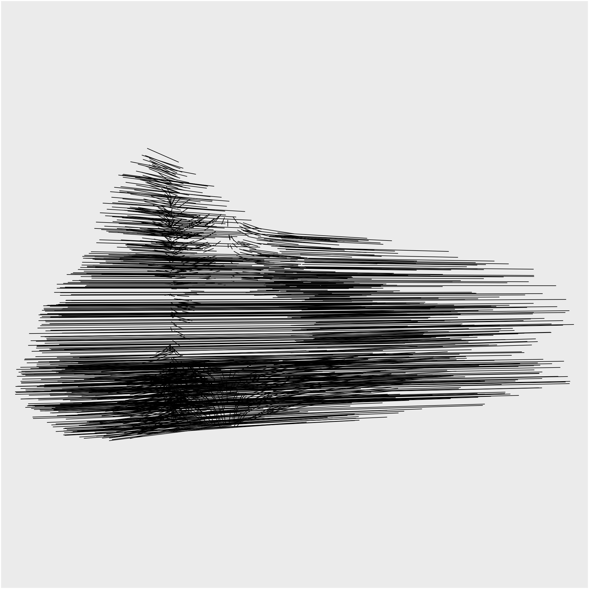
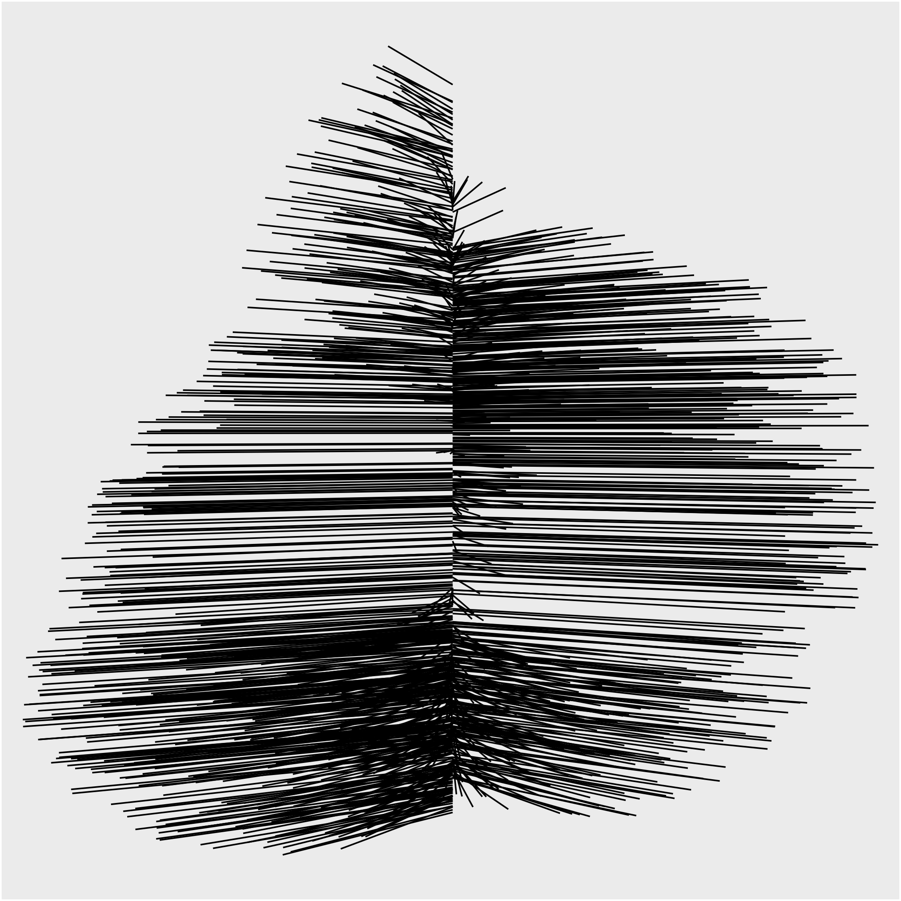
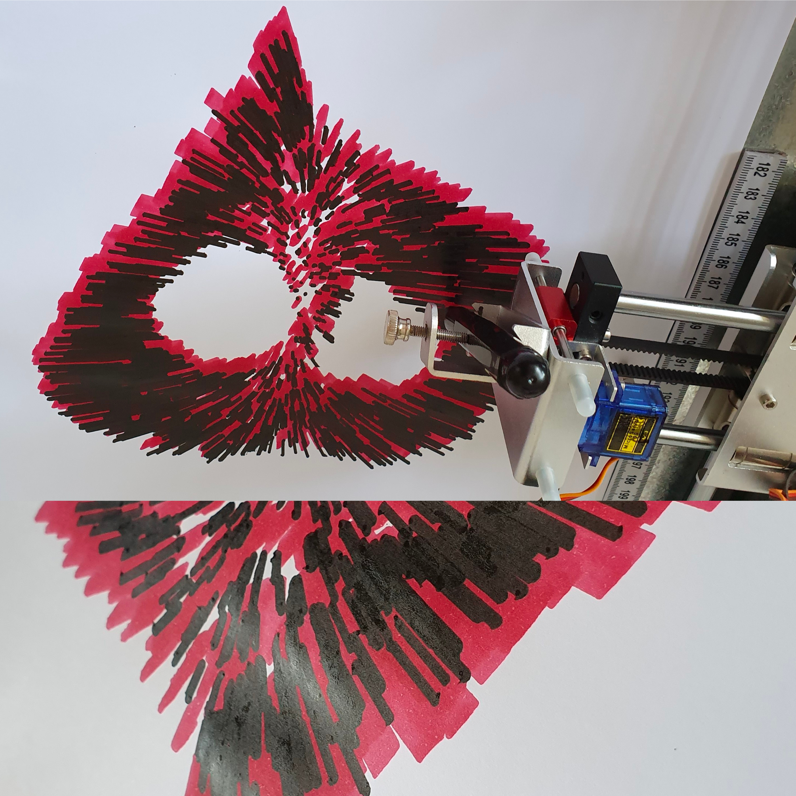
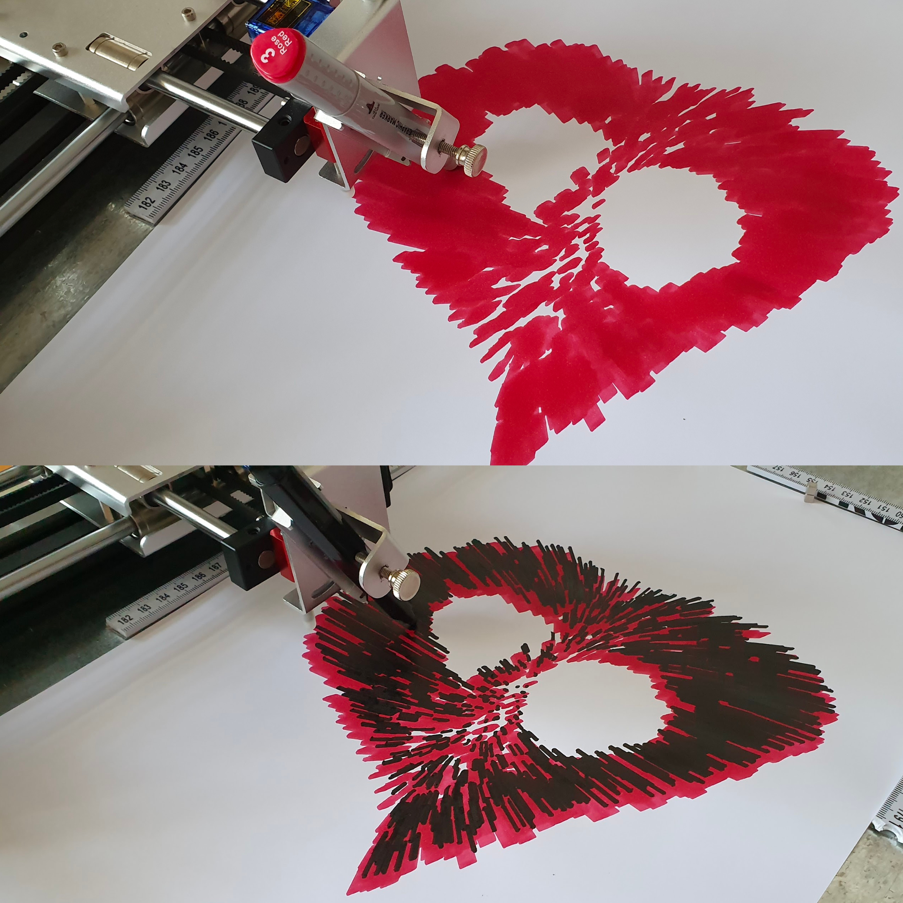
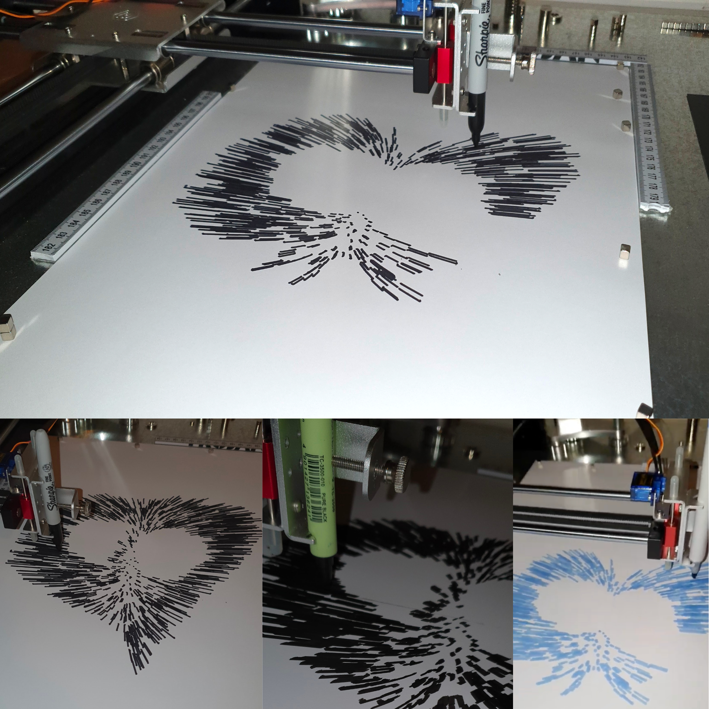

 

###### Experiment with lines, 2020

Experiment with letter Hae (color, sound, Nodebox), computer, handwritten letters in Persian Nastaliq style, calligraphy  
Dimensions variable, landscape orientation, square
